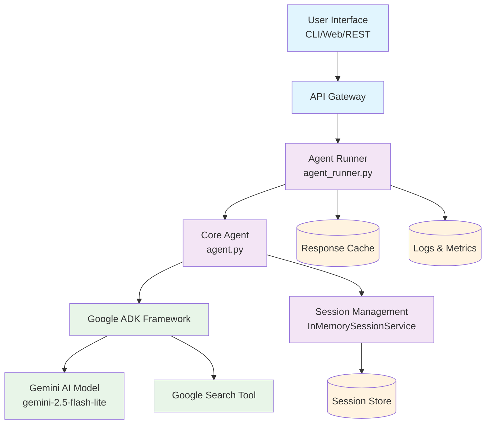

# 🏗️ System Architecture

## Overview

The Google ADK AI Agent is built with a **modular, scalable microservices-inspired architecture** that separates concerns and enables easy maintenance, testing, and extension. The system leverages Google's Agent Development Kit (ADK) to provide enterprise-grade AI capabilities with robust error handling and performance monitoring.

## Architecture Diagram



## System Components

### 1. 🎯 Agent Runner (`agent_runner.py`)
**Purpose**: Main orchestration and workflow management layer

**Responsibilities**:
- **Query Processing Management**: Route and manage query execution flow
- **Performance Tracking**: Monitor response times, success rates, and throughput
- **Error Handling & Retries**: Implement exponential backoff and circuit breaker patterns
- **Batch Processing Coordination**: Manage concurrent query execution with rate limiting
- **Metrics Collection**: Gather performance data for analytics and monitoring

**Key Classes**:
- `AgentRunner`: Main orchestrator class
- `AgentResponse`: Structured response container
- `PerformanceMetrics`: Monitoring and analytics data structure

### 2. 🤖 Core Agent (`agent.py`)
**Purpose**: Google ADK agent implementation and configuration

**Responsibilities**:
- **Agent Configuration**: Model selection, parameter tuning, and tool setup
- **Session Management**: Conversation context and state persistence
- **Tool Integration**: Google Search and extensible tool framework
- **Response Generation**: AI model interaction and output formatting
- **Security**: API key management and request validation

**Key Components**:
- `root_agent`: Primary agent instance
- `setup_session_and_runner()`: Session initialization
- `get_agent_response()`: Response generation wrapper

### 3. 💾 Session Management
**Purpose**: Maintain conversation context and user state

**Implementation**: `InMemorySessionService` from Google ADK

**Features**:
- **Multi-turn Conversations**: Context preservation across interactions
- **State Persistence**: User-specific data maintenance
- **Session Isolation**: Secure separation between users and applications
- **Automatic Expiration**: Configurable session timeouts

**Data Model**:
```python
Session {
    session_id: str
    user_id: str
    app_name: str
    conversation_history: List[Message]
    created_at: datetime
    last_accessed: datetime
}
```

### 4. 🛠️ Tools Integration
**Purpose**: Extend agent capabilities with external services

**Current Tools**:
- **Google Search**: Real-time information retrieval and fact verification
- **Web Content Analysis**: URL processing and content extraction

**Extensibility Framework**:
```python
class CustomTool:
    def __init__(self, config):
        self.config = config
    
    async def execute(self, input_data):
        # Tool implementation
        return processed_result
```

## Data Flow

### 1. 📥 Input Reception Phase
```
User Query → Input Validation → Query Enrichment → Session Context Loading
```
- **Input Validation**: Sanitize and validate user input
- **Query Enrichment**: Add metadata and contextual information
- **Session Loading**: Retrieve conversation history and user preferences

### 2. 🔄 Processing Phase
```
Session Context → Agent Processing → Tool Execution → Response Generation
```
- **Agent Processing**: Google ADK processes query with context
- **Tool Execution**: External services called if needed (Google Search)
- **Model Inference**: Gemini AI generates response based on available data

### 3. 📤 Output Delivery Phase
```
Response Generation → Formatting → Session Update → User Delivery
```
- **Response Formatting**: Structure output for different interfaces
- **Session Update**: Persist conversation history
- **Metrics Recording**: Log performance and usage data

## Configuration Management

### Environment-Based Configuration
```bash
# Required Configuration
GOOGLE_API_KEY=your_api_key_here
MODEL_NAME=gemini-2.5-flash-lite

# Optional Configuration
APP_NAME=google_search_agent
USER_ID=default_user
SESSION_ID=default_session
MAX_RETRIES=3
BATCH_SIZE=5
REQUEST_TIMEOUT=30
```

### Model Configuration
```python
agent_config = {
    "model": "gemini-2.5-flash-lite",
    "temperature": 0.7,
    "max_tokens": 1024,
    "top_p": 0.9,
    "tools": ["google_search"],
    "safety_settings": {
        "HARASSMENT": "BLOCK_MEDIUM_AND_ABOVE",
        "HATE_SPEECH": "BLOCK_MEDIUM_AND_ABOVE"
    }
}
```

## Error Handling & Resilience

### Multi-Layer Error Handling
1. **Input Validation Layer**: Sanitize and validate all inputs
2. **Network Resilience Layer**: Retry logic with exponential backoff
3. **Fallback Response Layer**: Graceful degradation when services fail
4. **Monitoring & Alerting Layer**: Real-time error tracking and notifications

### Error Recovery Strategies
- **Transient Failures**: Automatic retry with exponential backoff
- **Permanent Failures**: Circuit breaker pattern to prevent cascade failures
- **Partial Failures**: Graceful degradation with available tools
- **Data Loss Prevention**: Session persistence and recovery mechanisms

## Performance Optimization

### Caching Strategies
- **Session Cache**: In-memory session storage for low latency
- **Response Cache**: Frequently asked questions and common responses
- **Tool Result Cache**: External API call results with TTL

### Concurrency Management
```python
# Controlled concurrent processing
semaphore = asyncio.Semaphore(MAX_CONCURRENT_REQUESTS)

async def process_query(query):
    async with semaphore:
        return await agent.process(query)
```

### Performance Monitoring
- **Response Time Tracking**: P95, P99 latency monitoring
- **Throughput Metrics**: Queries per second/minute
- **Error Rate Monitoring**: Success/failure ratios
- **Resource Utilization**: Memory, CPU, and network usage

## Security Considerations

### Data Protection
- **API Key Security**: Environment variable storage and rotation
- **Input Sanitization**: Protection against injection attacks
- **Session Isolation**: Secure separation between users
- **Data Encryption**: HTTPS for all external communications

### Access Control
- **Rate Limiting**: Prevent abuse and ensure fair usage
- **User Authentication**: Optional user identity verification
- **Audit Logging**: Comprehensive activity tracking

## Deployment Architecture

### Development Environment
```
Local Machine → Python Virtual Environment → Local Testing
```

### Production Ready
```
Load Balancer → Multiple Instances → Redis Cache → Monitoring Stack
```

### Scalability Considerations
- **Horizontal Scaling**: Stateless design allows multiple instances
- **Database Scaling**: Session storage can scale independently
- **CDN Integration**: Static content delivery optimization

## Monitoring & Observability

### Key Metrics
- **Business Metrics**: Query volume, user engagement
- **Performance Metrics**: Response times, error rates
- **System Metrics**: Resource utilization, throughput
- **Quality Metrics**: Response relevance, user satisfaction

### Logging Strategy
```python
structured_log = {
    "timestamp": "2024-01-01T00:00:00Z",
    "level": "INFO",
    "component": "agent_runner",
    "query_id": "12345",
    "processing_time": 2.34,
    "success": True,
    "error": None
}
```
